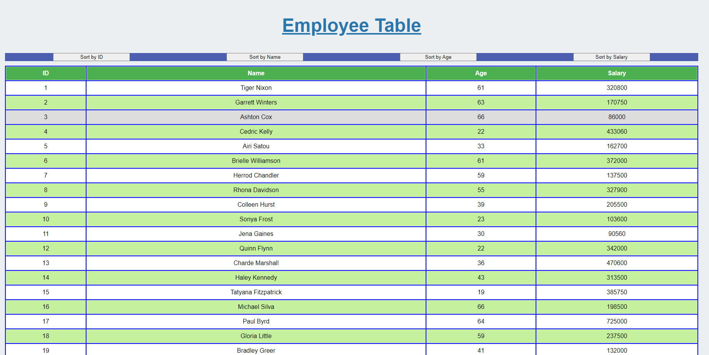

# Unit 19 React Homework: Employee Directory
## Description
This app lets users sort the table data in ascending order by ID number, name, age or salary. The data comes from a json file in the src folder, and user has no option to add/remove any data.

This app uses React JS to display the items using refactored components. The properties and sorting functions are passed through compnents through JSX.

## Installation
None! 
## Usage
Click the 4 buttons below the title to sort the table.
### License
MIT

#### Example Images

#### Questions?
If you have questions regarding this program: 
Send me a message through GitHub:  
