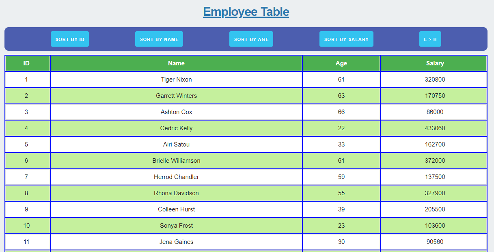

# Unit 19 React Homework: Employee Directory
## Description
This app lets users sort the table data in ascending order by ID number, name, age or salary. The data of the employee list comes from a json file from the src folder, so users do not have an option to add/remove any data.

There is also a toggle button to display the list in either ascending (L > H) or descending (H > L) order.

## Links
Deployed Project Link: https://umutamac.github.io/employee-directory/ 
Github Link: https://github.com/umutamac/employee-directory/

## Installation
None! Just go to deployed project link.

## Technologies and Tools
This app is built using React JS in order to have auto-rendering capability without refreshing the page, as well as keeping track of the state of the list order, and the whether the list is in a ascending or descending order. The styling uses Skeleton CSS mainly for the buttons.

### License
MIT

#### Example Images

#### Questions?
If you have questions regarding this program: 
Send me a message through GitHub:  
